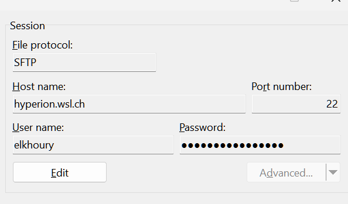
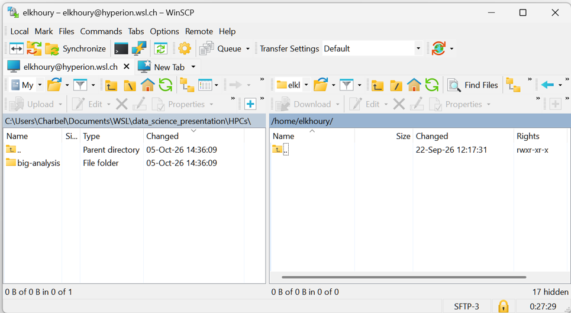

## Step 0: Gain Access to the Cluster

To gain access, send an email to IT support.

## Step 1: Connect to the Cluster

You will need to connect using SSH.

=== "Windows"
    The native Windows SSH client cannot connect to the cluster because it is out of date. You will need to install the Windows Subsystem for Linux (WSL), a Windows feature that lets you run a Linux environment directly on your PC.
    Find installation instructions [here](./installing_WSL_on_windows.md).

    Open PowerShell and start WSL:

      ```Powershell
      wsl
      ```

=== "Mac/Linux"

    No additional setup is required. Continue with the steps below.


Connect to Hyperion using SSH:

```bash
ssh <username>@hyperion.wsl.ch
```

Enter your password to connect. You should see a message like this:

```text
Last login: Tue Oct  6 09:08:52 2026 from 10.27.2.186
-----------------------------------------------------------------

  This is Hyperion - the master node of the new WSL Linux cluster.

  Here you can manage your files, compile code and submit
  batch jobs to the queueing system SLURM.

  Please DO NOT run long processes on *this* computer.
  Use the queueing system SLURM instead.

  For information about how to use the cluster, see

    http://hyperion.wsl.ch/

  For technical support please use helpdesk address

    http://intra.wsl.ch/it/helpdesk/Stoerungsmeldung_Cluster1_DE

-----------------------------------------------------------------
[elkhoury@hyperion ~]$

```

## Set Up Your Workspace

At this point, it is a good idea to familiarize yourself with basic Linux commands, if you are not already familiar with them. This will make it easier to navigate the cluster's file system. [This section](./linux_cheat_sheet.md) provides some basic Unix commands.

If this is your first time using the cluster, create a personal folder on the `/storage/` drive to keep your projects separate from those of other users:
```bash
cd /storage              # Go to the storage directory
mkdir <your-username>    # Create a folder
cd <your-username>       # Move into your new folder
```


## Prepare Your Development Environment

The software stack on the cluster is not regularly updated, so the latest releases of Python, R, and other tools may not be available. This can be a problem if you need a library that only works with a more recent release.

To use the latest versions of R or Python, install an environment manager such as Conda or Mamba.

Check whether Mamba is installed:
```bash
mamba -h
```

If you see the following output, Mamba is not installed:

```bash
bash: mamba: command not found...
```

To install it, follow the [Installing Mamba](./installing_mamba.md) guide.

Then test the installation:
```bash 
mamba -h
```

You are now ready to create an environment. Follow the instructions in [Using Mamba](./using_mamba.md).

> **Note:** A new copy of R and its packages is installed in each environment. This can create a large number of files and slow down the cluster. It is therefore a good idea to create one environment with the latest version of R and use it for most projects. If a project requires an older version of R, create a separate environment for it.

## Moving data to the cluster

The easiest way to transfer files is to use a file transfer client such as WinSCP (Windows only) or Cyberduck (Windows and macOS).

Set up a new connection using the following settings:


This lets you connect to the cluster's storage system and drag and drop project files and data between the cluster and your computer:



## Running Code

You cannot run code directly on the cluster after transferring it. If you do, it will run on the login node, which is slower and less powerful than the compute nodes. To run code on the compute nodes, you must write a job script.

### The Job Script

A job script tells the scheduler how many resources your job requires, how long it should run, where to send notifications if it succeeds, fails, or is cancelled, what software to use, and what code to run.

A basic job script looks like this:

```bash
#!/bin/bash
# Example requesting more resources than the default

#SBATCH --mail-user=charbel.elkhoury@wsl.ch # Your email address
#SBATCH --mail-type=SUBMIT,END,FAIL # Notify you of these events
#SBATCH -o out # Standard output
#SBATCH -e err # Standard error output
#SBATCH --mem=4000M # Request 4 GB of RAM
#SBATCH --time=10:00 # Run for 10 minutes
#SBATCH -n 1 # One core

/storage/elkhoury/mamba/installation/etc/profile.d/mamba.sh
mamba activate r_env_demo
Rscript main.R
```

Store this file in the same folder as the code you want to run. For example, name it `jobscript.sh`.


### Submit a Job Script

Submit the job with the following command:

```bash
sbatch jobscript.sh
```

## Monitoring a job

After submitting a job with `sbatch`, you can check whether it is still queued or running with:

```bash
squeue -u <username>
```

Typical output looks like:

```text
JOBID   PARTITION   NAME       USER   ST   TIME     NODES
12345   normal      analysis   ck     R    03:21    1
```

The most useful columns are:

- `JOBID` — unique job identifier
- `NAME` — job name
- `ST` — job state
- `TIME` — how long the job has been running

Common job states include:

| State | Meaning |
|---|---|
| `R` | Running |
| `PD` | Pending |
| `CG` | Completing |

To continuously monitor your jobs, use `watch`:

```bash
watch squeue -u <username>
```

This refreshes the output every two seconds.

Press `Ctrl+C` to stop `watch`.

---

## Checking job output and errors

Slurm writes the program's normal output and error messages to files. If your submission script defines them as:

```bash
#SBATCH --output=out
#SBATCH --error=err
```

you will get two files:

```text
out
err
```

### Read the output

For a short file:

```bash
cat out
```

For a longer file:

```bash
less out
```

Use the arrow keys to navigate and press `q` to exit.

To see only the last lines:

```bash
tail out
```

### Monitor output while the job is running

```bash
tail -f out
```

This displays new output as it is written.

Press `Ctrl+C` to stop following the file.

You can do the same with the error file:

```bash
tail -f err
```

### Check for errors

Read the complete error file:

```bash
cat err
```

or inspect it with:

```bash
less err
```

An empty `err` file generally means that nothing was written to standard error.

> Messages in `err` do not necessarily mean that the job failed. Programs may also write warnings and diagnostic information to standard error.